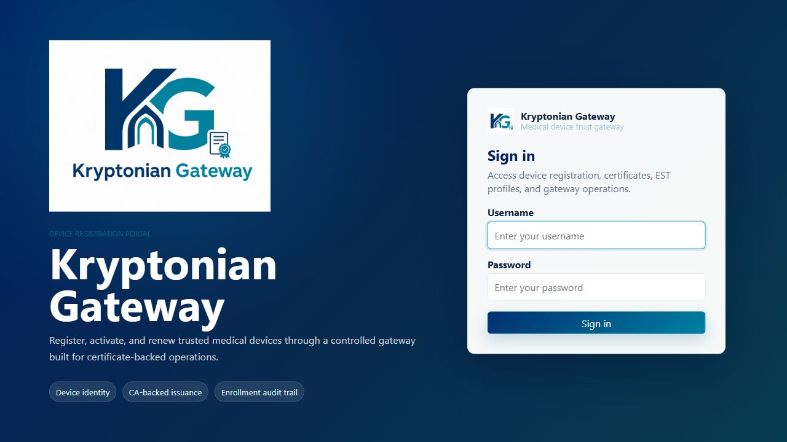
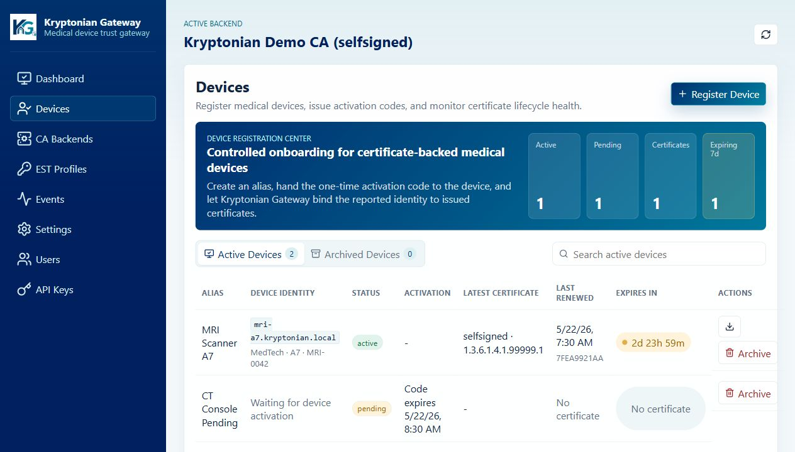
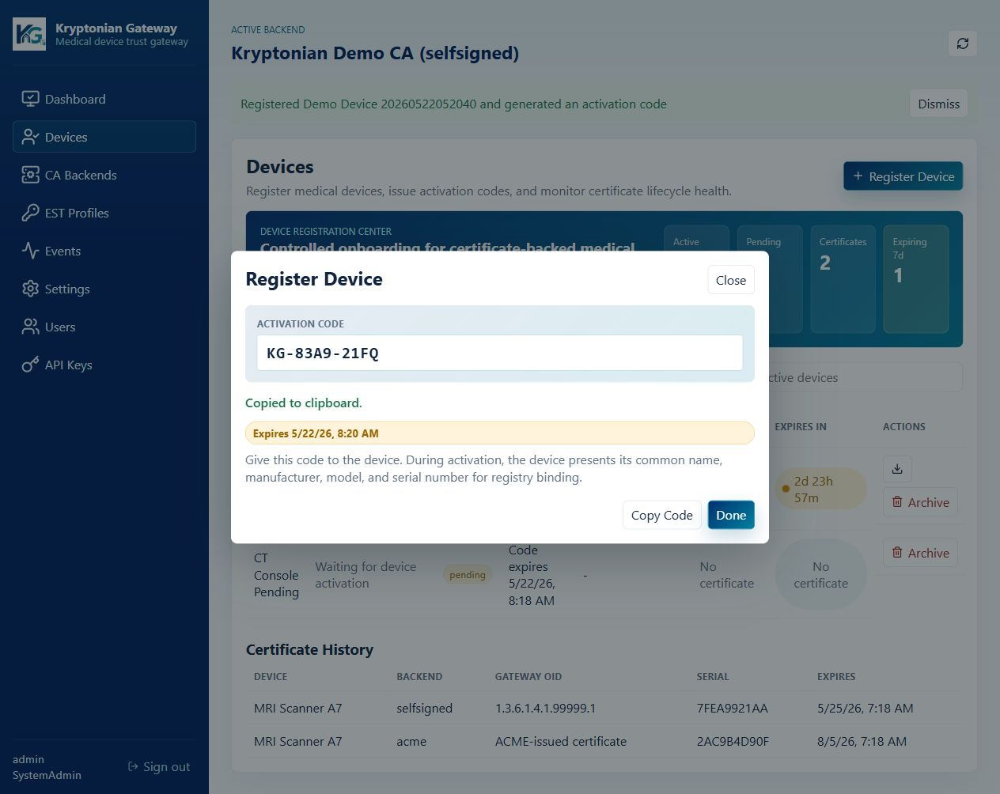
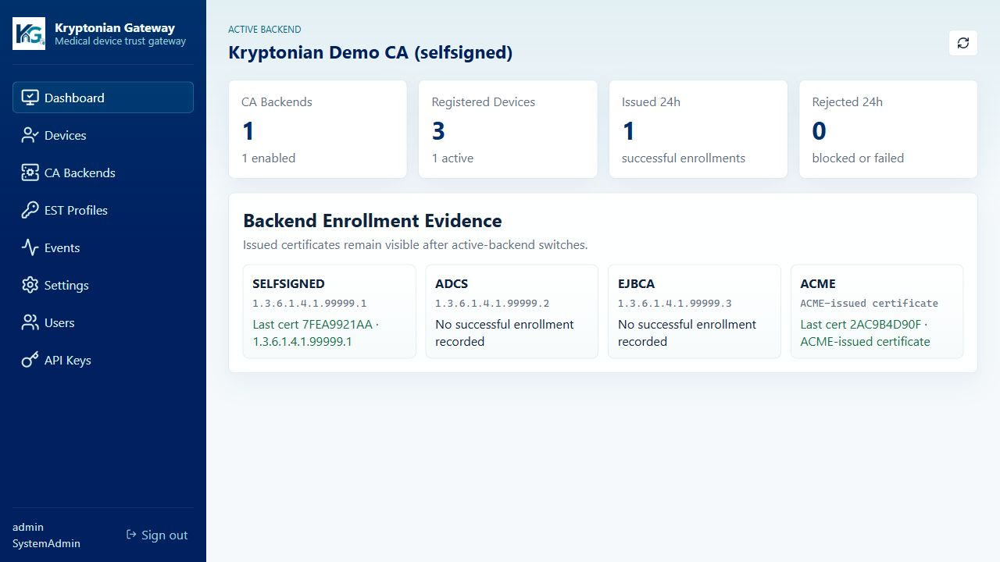
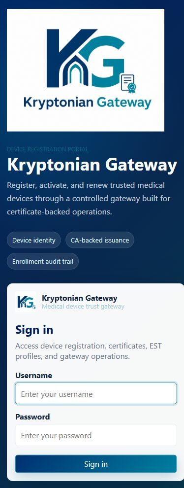

# Kryptonian Gateway
A reference implementation and test environment from [AAPM RT-SEC](https://www.aapm.org/) for medical-device certificate enrollment and renewal using **EST (RFC 7030)** and existing PKI. The project aims to contribute operational DICOM lifecycle evidence to the OR.NET / IEEE 11073 SDC enrollment work, not define a competing protocol.

> **Note:** This proof-of-concept originated at the AAPM RT-SEC annual meeting in Trento, Italy (2026), previously under the MEDIATE working name. It is **not intended for clinical deployment** and is not an adopted OR.NET enrollment profile, SDC conformity implementation, or DICOM TLS certification. Independent security assessment and joint interoperability testing remain necessary.

Start with the [local developer system](docs/development.md), [implementation/PR tracker](docs/IMPLEMENTATION-TRACKER.md), and [Wednesday architecture briefing](docs/ORNET-ALIGNMENT-2026-09-09.md).

---

## Overview

Kryptonian connects device-side EST clients to hospital-authorized certificate authorities. DICOM and SDC retain their existing application protocols. An operational TLS identity does not itself establish a device's clinical capability, regulatory status, or SDC role authorization.

The gateway sits between medical devices and one or more certificate authority backends, providing:

- **Device enrollment** — Devices register with an activation code, are reviewed and approved by an administrator, then automatically receive certificates.
- **Automatic certificate renewal** — Approved devices renew certificates without administrator intervention unless their privileges are revoked.
- **Renewal monitoring** — Administrators receive notifications when certificates are not being renewed as expected, signaling potential device problems.
- **Multi-CA abstraction** — A single EST interface for devices regardless of which CA backend the institution uses.

---

## What It Looks Like

Kryptonian Gateway includes a branded administrator portal for device registration, certificate lifecycle operations, CA backend configuration, EST profile management, user administration, and audit review.

### Login portal

The login experience introduces the gateway as a medical device trust portal and keeps the operational form immediately accessible.



### Device Registration Center

The Devices page is the primary operating surface. Administrators can register devices, issue one-time activation codes, inspect device identity, track pending activations, and monitor certificate expiry.



### Activation code workflow

Device onboarding produces a short-lived activation code that can be handed to the device. During activation, the device presents its common name, manufacturer, model, and serial number for registry binding.



### Gateway dashboard

The dashboard summarizes CA backend state, registered device counts, enrollment outcomes, and backend evidence so administrators can quickly understand gateway health.



### Responsive portal

The portal is responsive for smaller operational screens while preserving the same branding and device-registration workflow.



---

## CA Backends

| Backend | Status | Description |
|---|---|---|
| **Self-Signed** | Supported | Local certificate authority; suitable for development and isolated networks |
| **ACME** | Supported | Compatible with Let's Encrypt, ZeroSSL, and any ACME-compliant CA |
| **ADCS** | Implemented (harness) | Microsoft Active Directory Certificate Services via SCEP |
| **EJBCA** | Implemented (harness) | Enterprise Java Beans CA via REST |
| **CloudFlare CFSSL** | Planned | — |
| **HashiCorp Vault** | Planned | PKI Secrets Engine |
| **Smallstep** | Planned | Modern open-source CA |
| **OpenXPKI** | Planned | Open-source enterprise PKI |

The CA harness (`RTSec.Kryptonian.CaHarness`) emulates the above backends locally so the full enrollment flow can be exercised without external CA infrastructure.

---

## Features

- EST protocol endpoints (`/simpleenroll`, `/simplereenroll`, `/cacerts`)
- Admin REST API with JWT authentication
- Role-based access control (SystemAdmin, Admin, Viewer)
- Blazor Server admin dashboard with React/TypeScript frontend
- Full audit trail for all enrollment and revocation events
- Email notifications for certificate expiry and renewal anomalies
- Docker-ready with a single `docker compose up`

---

## Getting Started

### Prerequisites

- [Docker Desktop](https://www.docker.com/products/docker-desktop/)

### Run the stack

```bash
docker compose up
```

This starts three services:

| Service | URL | Description |
|---|---|---|
| **API** | `http://localhost:5000` | EST + Admin REST API |
| **Web UI** | `http://localhost:5001` | Blazor admin dashboard |
| **PostgreSQL** | `localhost:5432` | Database |

To also start the optional CA harness (emulates ADCS, EJBCA, Self-Signed, and ACME via step-ca):

```bash
docker compose -f docker-compose.yml -f docker-compose.hackathon.yml up
```

### Pre-seeded demo account

| Field | Value |
|---|---|
| Username | `admin` |
| Password | `rtsec2026` |
| Email | `demo@email.com` |
| Role | `SystemAdmin` |

---

## Hello World: Self-Signed Device Activation

This flow starts a fresh local gateway, adds a self-signed CA backend, registers a pending device, generates an activation code, and uses that code to enroll a device certificate through EST.

Prerequisites: Docker Desktop, OpenSSL, and a Bash-compatible shell with `curl` and `sed`.

```bash
# Generate local test certificates and an EST CSR into ./certs.
./scripts/generate-test-certs.sh

# Start PostgreSQL and the API. ADMIN_API_KEYS makes the curl examples authenticate.
ADMIN_API_KEYS='dev-api-key-change-in-production' \
CA_PFX_PASSWORD='TestPassword123!' \
docker compose up -d --build

BASE_URL='http://localhost:5000'
API_KEY='dev-api-key-change-in-production'

curl "$BASE_URL/api/status/health"
```

Create and activate a self-signed CA backend. `./certs` is mounted into the API container at `/app/certs`.

```bash
BACKEND_ID=$(
  curl -s -X POST "$BASE_URL/api/cas" \
    -H "X-API-Key: $API_KEY" \
    -H "Content-Type: application/json" \
    -d '{
      "name": "Local Self-Signed CA",
      "type": "selfsigned",
      "isEnabled": true,
      "isActive": true,
      "config": {
        "PfxPath": "/app/certs/ca.pfx",
        "PfxPassword": "TestPassword123!"
      }
    }' | sed -n 's/.*"id":"\([^"]*\)".*/\1/p'
)

echo "$BACKEND_ID"
```

Create an EST profile for local enrollment requests.

```bash
curl -s -X POST "$BASE_URL/api/est-profiles" \
  -H "X-API-Key: $API_KEY" \
  -H "Content-Type: application/json" \
  -d "{
    \"name\": \"Local Device EST\",
    \"hostnames\": [\"localhost\"],
    \"hostnameMatchType\": \"exact\",
    \"pathPrefix\": \"/.well-known/est\",
    \"caBackendId\": \"$BACKEND_ID\",
    \"allowedKeyUsages\": [\"digitalSignature\", \"keyEncipherment\"],
    \"validityDays\": 365,
    \"requireClientCertificate\": false,
    \"validateClientCertificateChain\": false,
    \"trustedClientCaThumbprints\": [],
    \"isEnabled\": true
  }"
```

Register a pending device and generate its one-time activation code.

```bash
DEVICE_ID=$(
  curl -s -X POST "$BASE_URL/api/devices" \
    -H "X-API-Key: $API_KEY" \
    -H "Content-Type: application/json" \
    -d '{"displayName":"Hello World Device","subjectCommonName":"test-device-enroll","manufacturer":"RTSec","model":"Local Test","serialNumber":"hello-world-001"}' \
    | sed -n 's/.*"id":"\([^"]*\)".*/\1/p'
)

ACTIVATION_CODE=$(
  curl -s -X POST "$BASE_URL/api/devices/$DEVICE_ID/activation-code" \
    -H "X-API-Key: $API_KEY" \
    -H "Content-Type: application/json" \
    -d '{"validForMinutes":60}' \
    | sed -n 's/.*"activationCode":"\([^"]*\)".*/\1/p'
)

echo "$ACTIVATION_CODE"
```

Enroll the generated test CSR using standard HTTP Basic over authenticated HTTPS: the username is the registered device UUID and the password is its one-time activation code. The CSR must match the administratively approved common name. The automated developer verifier passes credentials through stdin, keeping them off the process command line; this short interactive example exposes them to local process inspection.

```bash
curl -i -X POST "$BASE_URL/.well-known/est/simpleenroll" \
  -H "Content-Type: application/pkcs10" \
  -H "Content-Transfer-Encoding: base64" \
  --user "$DEVICE_ID:$ACTIVATION_CODE" \
  --data-binary @certs/test-enroll.b64
```

Expected result: `HTTP/1.1 200 OK`, `Content-Type: application/pkcs7-mime; smime-type=certs-only`, and a base64 PKCS#7 certificate response body. The device record is marked active after the activation code is consumed.

---

## Demo Walkthrough

### 1. Register a device

1. Log in to the admin dashboard at `http://localhost:5001`.
2. Navigate to **Devices** and create a new device registration.
3. Copy the **device activation code** generated for that device.

### 2. Enroll a device

Open the `Kryptonian.MedicalDevice` WPF application (Windows). This is a simulated medical device that demonstrates how a real device would:

1. Submit a Certificate Signing Request (CSR) using the activation code.
2. Receive and install the issued certificate.
3. Automatically renew the certificate on schedule using EST `simplereenroll`.

See [`src/Kryptonian.MedicalDevice`](src/Kryptonian.MedicalDevice/) for the enrollment implementation, which can be adapted for other device platforms.

### 3. DICOM TLS demo

[`src/Kryptonian.DICOMTls`](src/Kryptonian.DICOMTls/) demonstrates how two medical devices can establish a **mutually authenticated TLS (mTLS)** DICOM connection using gateway-issued certificates. It shows the gateway governing trust end-to-end — from certificate issuance through connection validation — across the supported CA backends.

Run the operator-friendly demo from the repository root:

```powershell
dotnet run --project .\src\Kryptonian.DICOMTls\Kryptonian.DICOMTls.csproj
```

The console app will:

1. Prompt for an admin API key.
2. Create two temporary demo devices and activation codes through the gateway admin API.
3. Enroll each device through EST and receive gateway-issued certificates.
4. Start a local fo-dicom TLS Store SCP for the receiver.
5. Generate dummy Secondary Capture DICOM files.
6. Send the files from the sender AE to the receiver AE over DIMSE TLS with mutual certificate authentication.
7. Print the certificate subjects, issuers, thumbprints, trust results, association acceptance, C-STORE status for each SOP Instance UID, and received file paths.
8. Ask `Are you ready to remove demo devices?` and, if confirmed, archive and delete the temporary demo devices from the gateway.

Useful options:

```powershell
dotnet run --project .\src\Kryptonian.DICOMTls\Kryptonian.DICOMTls.csproj -- --count 5
dotnet run --project .\src\Kryptonian.DICOMTls\Kryptonian.DICOMTls.csproj -- --port 11115
```

---

## Documentation

| Document | Description |
|---|---|
| [`docs/ARCHITECTURE.md`](docs/ARCHITECTURE.md) | System design, Clean Architecture layers, and data flow |
| [`docs/API-GUIDE.md`](docs/API-GUIDE.md) | REST API reference with authentication and examples |
| [`docs/device-enrollment.md`](docs/device-enrollment.md) | EST enrollment flow in detail |
| [`docs/ca-backend-configuration.md`](docs/ca-backend-configuration.md) | Configuration guide for each CA backend |
| [`docs/user-management.md`](docs/user-management.md) | User accounts, roles, and access control |
| [`docs/email-notifications.md`](docs/email-notifications.md) | Notification configuration |
| [`docs/DEPLOYMENT.md`](docs/DEPLOYMENT.md) | Production deployment guidance |
| [`docs/admin-setup.md`](docs/admin-setup.md) | Initial administrator setup |

---

## Project Structure

```
src/
├── RTSec.Kryptonian.Api          # ASP.NET Core REST API (EST + Admin endpoints)
├── RTSec.Kryptonian.Web          # Blazor Server admin dashboard
├── RTSec.Kryptonian.Ui           # React/TypeScript frontend (embedded in Web)
├── RTSec.Kryptonian.Domain       # Core entities, interfaces, value objects
├── RTSec.Kryptonian.Application  # Business logic, services, DTOs
├── RTSec.Kryptonian.Infrastructure # EF Core, CA connectors, cryptography
├── RTSec.Kryptonian.CaHarness   # Local CA emulator for development
├── Kryptonian.MedicalDevice      # WPF device simulator (Windows)
└── Kryptonian.DICOMTls           # DICOM mTLS demonstration
```

---

## Contributing

This project is maintained by the AAPM RT-SEC working group. Issues and pull requests are welcome.

---

## Disclaimer

This software is a research prototype. It has not undergone formal security review and must not be used in clinical or production environments without independent security assessment.
